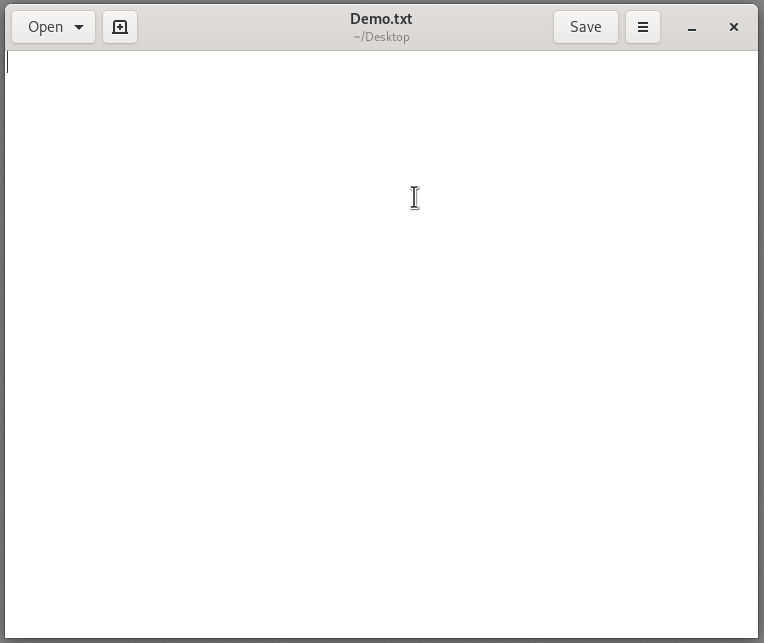

gedit-hide-header-buttons
=========================

Hides buttons from gedit's header bar, making the interface more minimal and
keyboard-driven.



The way this plugin is written is pretty fragile. It depends on the current
(gedit 3.32.0) UI layout and could break if the UI changes in future versions.
It could be implemented in a more robust way but for now this works.

Installation
------------

```
mkdir -p ~/.local/share/gedit/plugins
git clone https://github.com/seanh/gedit-hide-header-buttons.git ~/.local/share/gedit/plugins/gedit-hide-header-buttons
```

Then in gedit go to <kbd>Preferences</kbd> → <kbd>Plugins</kbd> and enable the **Hide Header Buttons** plugin.
